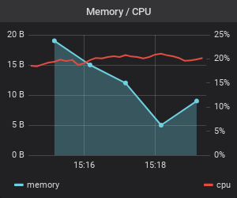

= Image rendering issue
:grafana: https://play.grafana.org

[%autowidth,cols="1*,1*a",options="header"]
|===
| Attribute
| Image

| Inline old format
| image:{grafana}/render/dashboard-solo/db/grafana-play-home?orgId=1&from=now-5m&to=now&panelId=4&width=300&height=250&tz=UTC[inline-new,format=png]

| Inline new URL format
| image:https://play.grafana.org/render/d-solo/000000012/grafana-play-home?orgId=1&from=now-5m&to=now&panelId=4&width=300&height=250&tz=UTC[inline-new,format=png]

| Local image
| 

| Not an image
| image:http httphahahahaha [fake,format=png]
|===

